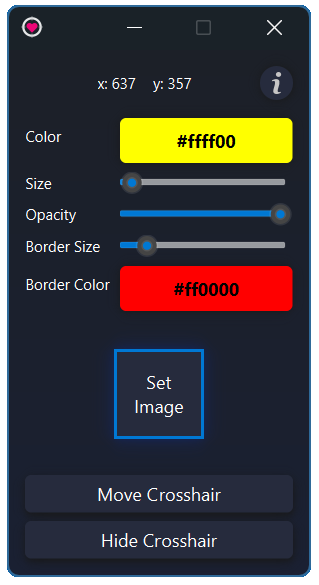

  

<h1 align="center">HolySight</h1>

A simple and lightweight crosshair overlay.

## Features
- Adjust crosshair size, opacity, color, and border
- Load custom images (PNG, JPG etc.)
- Minimalist design 

## Installation
1. Download the ZIP file from the Releases page  
2. Extract it  
3. Open `HolySight.exe` 

## Usage

When you launch the app, a crosshair will appear on your screen along with the Settings window.
From the Settings panel, you can:
- Customize the crosshair color
- Adjust its size
- Load a custom image to use as your crosshair

## License
MIT License. See [LICENSE](LICENSE).
