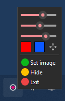

# HolySight
HolySight is a lightweight crosshair overlay made with PySide6.

## Features
- Adjust crosshair size, opacity, color, and border
- Load custom images (PNG, JPG etc.)
- Minimalist design 

## Installation
- Download zip file from release page and extract it
- Locate `HolySight.exe` and open it.
It's portable app so no installation needed.

## Usage

When you open the app, youll see the crosshair and a settings window.
You can configure your crosshair such as the color and size. You also can load an image as the crosshair.

## License
MIT License. See [LICENSE](LICENSE).
