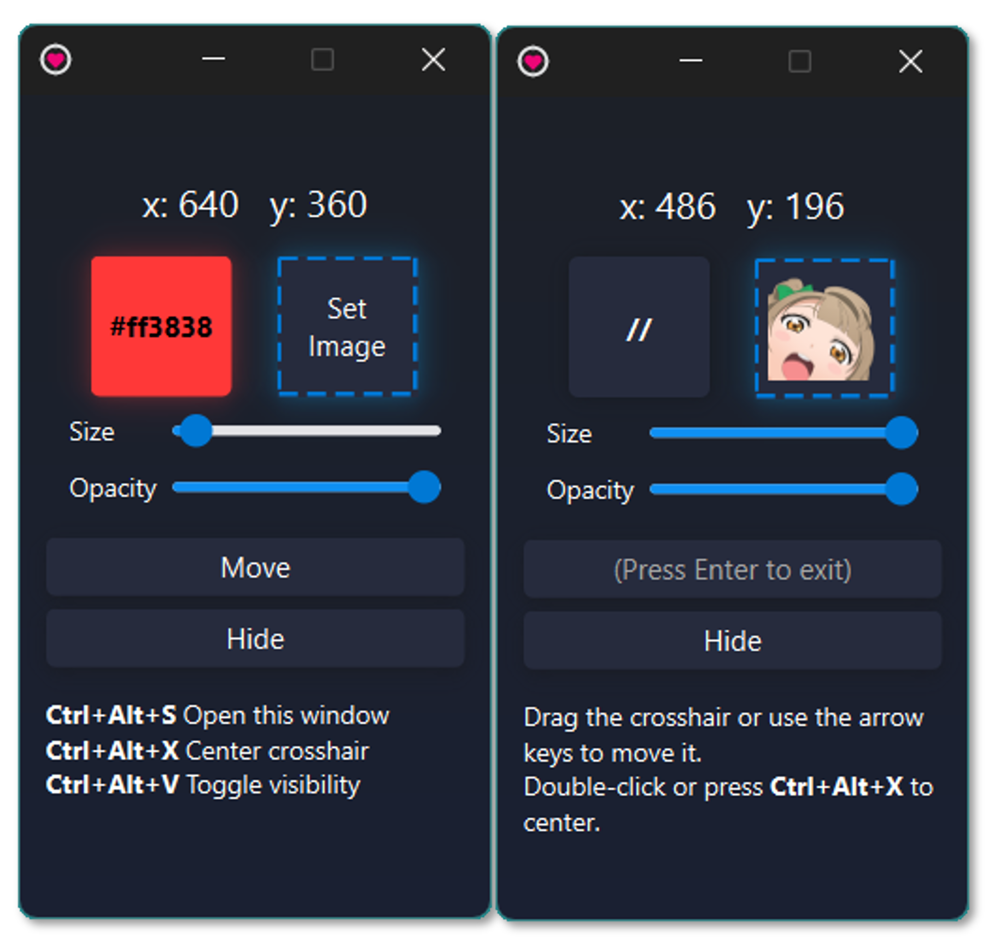

  

<h1 align="center">HolySight</h1>

A simple and lightweight crosshair overlay.

## Features
- Adjust crosshair size, opacity, color
- Load custom images (PNG, JPG etc.)
- Minimalist design 

## Installation
1. Download `HolySight_v1.2.0_Setup.exe` from the [Releases](https://github.com/MaxLevelNPC/HolySight/releases) page.
2. Run the installer and follow the setup wizard.
3. Launch **HolySight** from your Desktop or Start Menu.

## Usage

When you launch the app, a crosshair will appear on your screen along with the Settings window.
From the Settings panel, you can:
- Customize the crosshair color
- Adjust its size
- Load a custom image to use as your crosshair

## License
MIT License. See [LICENSE](LICENSE).
